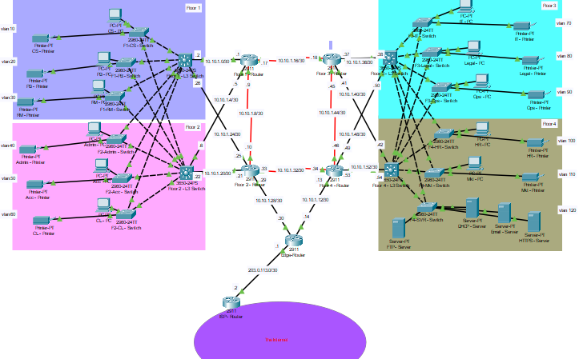

# 🏦 Bank Enterprise Network Design

**Author:** El Mahdi ARFAL  
**Academic Year:** 2024/2025  
**Institution:** Institut National des Postes et Télécommunications  

---

## 📌 Project Overview

BankNet is a robust enterprise-grade network designed for a banking institution. It follows a **collapsed core architecture**, optimizing for redundancy, scalability, and segmented services. With 12 VLANs, dynamic OSPF routing, HSRP redundancy, centralized DHCP/DNS, and internal service hosting, the design ensures security, availability, and operational continuity.

---

## 📂 Repository Contents

- `Bank_Network.pkt` – Cisco Packet Tracer simulation file of the full network  
- `network_architecture.png` – High-level topology diagram  
- `Network_Report.pdf` – Project report
- `Device_Passwords.txt` - Passwords to access the devices in the Bank_Network.pkt file

---

## 🧠 Key Features

- **Architecture**: Collapsed core with L3 switches as core/distribution layer
- **Segmentation**: 12 VLANs (11 departments + 1 server room)
- **Routing**: OSPF dynamic routing across L3 switches and routers
- **Redundancy**: HSRP configured on L3 switch pairs for gateway failover
- **Services**:
  - DHCP & DNS (central server)
  - FTP (main NAS)
  - HTTP server (internal apps)
  - Mail server (internal email)
- **Security**:
  - Port security on access switches
  - ACLs and NAT on edge router
  - SSH-only management access
- **Stability**: STP enabled across switches

---

## 🛠 Hardware Simulated

| Component       | Role                                             |
|----------------|--------------------------------------------------|
| L3 Switches     | Routing, VLAN gateways, HSRP, OSPF               |
| Access Switches | Host access, VLAN enforcement, port security     |
| Routers         | Interconnects, OSPF, ACLs, NAT                   |
| DHCP-DNS Server | Addressing & name resolution                    |
| FTP Server      | NAS for internal storage                         |
| HTTP Server     | Internal web hosting                             |
| Mail Server     | Internal communication                           |

---

## 🧩 Architecture Snapshot

---

## 🧪 Deployment Summary

| Service        | Status                               |
|----------------|--------------------------------------|
| VLANs          | 12 active                            |
| Inter-VLAN     | Via SVIs on L3 switches              |
| DHCP/DNS       | Configured on central server         |
| FTP            | Internal NAS                         |
| HTTP           | Internal application hosting         |
| Mail           | Internal messaging                   |
| HSRP           | Enabled on L3 switch pairs           |
| ACLs           | Applied on edge router               |
| NAT            | For external internet access         |
| STP            | Loop prevention on switches          |
| SSH Access     | Console & vty secured via SSH only   |

---

## 📚 Report

View the full technical documentation here 👉 [Network_Report.pdf](./Network_Report.pdf)

---

## 🧭 Future Enhancements

- Implementation of **QoS** for traffic prioritization  
- Integration of **Syslog/SNMP** for centralized monitoring  
- Possible **VPN access** for remote banking branches  

---

> Designed, configured, and documented by El Mahdi Arfal
